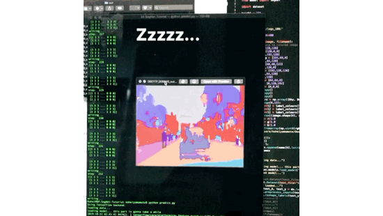

# Segmantic Segmentation (SegNet)
******

SegNet is to segment objects contained in a image.
Refer to this paper: [SegNet: A Deep Convolutional
Encoder-Decoder Architecture for Image
Segmentation](https://arxiv.org/pdf/1511.00561)

The below is a procedure to run this programme.
You may need to handle library dependencies and incompatability issues caused by versions conflicts or path configurations.

1. $ train.py
	* 	Make sure that you have CamVid dataset (test/testannot/train/trainannot/val/valannot) in the corresponding dir before training a model with valid parameters.

2. After training the model, delete test directory from Camvid and divide your test datasets into several non-identical directories (e.g. test1, test2, test3, each test directory can contain around 1000 images or so) as huge batch will cause an overload on memory and an execution is going to killed. (JFYI 16GB in my case.) 
	* Accoerdingly, fix run.sh

3. $ ./run.sh
	1. preprocess_testdata.py
		* get all the filenames placed in test directory
		* overwrite text.txt
		* duplicate a randomly labelled image into testannot 
	2. predict.py
		* output segmented results into out directory 

4. $ segmented_img_analyser.py
	* output a report (as pixel_parsed_report.csv) after parsing pixel by pixel in each image.
		
******

Kohei Yamamoto

National University of Singapore (NUS)

With reference to 
[Alex Kendall](https://github.com/alexgkendall/SegNet-Tutorial), 
[uni-3](https://qiita.com/uni-3/items/a62daa5a03a02f5fa46d)
